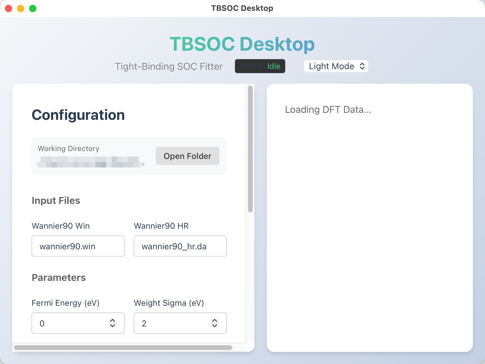

<div align="center">
  
  
  # TBSOC (Wannier + On-site SOC)
  
  **A lightweight, high-performance Python package for adding On-Site Spin-Orbit Coupling to Wannier90 Tight-Binding models**
  
  [](https://www.python.org/downloads/)
  [](LICENSE)
  [](https://github.com/google/jax)
  
</div>

---

## ✨ Key Features
- **High Performance**: Powered by **JAX** and **Just-In-Time (JIT)** compilation for lightning-fast fitting (<1s for typical systems).
- **Auto-Alignment**: Automatically detects the correct matching between TB and DFT bands, including partial band overlap when DFT has fewer bands than TB.
- **Physically-Aware**: Uses **Gaussian-weighted loss** centered at the Fermi level to prioritize accuracy near the Fermi surface.
- **Differentiable**: Uses exact gradients (Automatic Differentiation) for robust convergence, replacing slow derivative-free methods.
- **Non-Negative Constraints**: Enforces physically meaningful $\lambda \geq 0$ during optimization.
- **Flexible**: Supports custom local axes and spin quantization axes.

## Installation

### 📦 Install via Pre-built Desktop App (Easiest)
For users who want to use the GUI without installing Python:
1. Go to the [**Releases Page**](https://github.com/DeePTB-Lab/TBSOC/releases).
2. Download the installer for your OS:
   - **Windows**: `TBSOC-Windows-Installer.exe`
   - **macOS**: `TBSOC-macOS.dmg`
3. Run the installer/DMG to set up TBSOC.

> **Note for macOS**: You may need to right-click the app and select 'Open' to bypass security check for unnotarized apps.

### 🐍 Install from Source (For Developers/CLI)
If you prefer the command line or want to modify the code:

#### Prerequisites
- Python 3.9+
- [uv](https://github.com/astral-sh/uv) (Recommended for package management)

### Install via uv (Recommended)
```bash
git clone https://github.com/DeePTB-Lab/TBSOC.git
cd TBSOC
uv sync
```

### Install via pip
```bash
pip install .
```

## 🖥️ Desktop GUI Application

TBSOC includes a modern web-based desktop application for interactive parameter tuning and real-time visualization.



### Prerequisites
- Ensure `uv` is installed.
- Frontend is pre-built and included in the repository.

### How to Run
1. **Install Dependencies**:
   ```bash
   uv sync
   ```

2. **Launch the App**:
   ```bash
   uv run python -m tbsoc.server.main
   ```
   This will start a local server and open the GUI in your default browser at `http://localhost:8000`.

> **⚠️ macOS Users**: If you see a security warning when opening the app, see [macOS Installation Guide](docs/macOS_Installation.md) for instructions on how to safely open unsigned apps.

### GUI Features
- **Interactive Parameter Editor**: 
  - Configure file paths (POSCAR, EIGENVAL, Wannier90 files) with native file picker
  - Set Fermi energy and weighting parameters
  - Adjust SOC parameters ($\lambda$) with live sliders
- **Real-Time Band Visualization**: 
  - Overlay TB+SOC bands (red) on DFT reference (blue dashed)
  - Visualize Gaussian weighting function
  - Auto-aligned k-point labels and high-symmetry points
- **Modern UI**:
  - **Light/Dark Mode** support
  - **Live Preview Mode**: Drag sliders to instantly see band structure changes
  - **One-Click Fitting**: Run JAX-accelerated optimization with progress tracking
  - **Partial Band Support**: Handles cases where DFT calculations have fewer bands than the TB model

---

## 🚀 Usage (Command Line)

TBSOC provides a command-line interface (`tbsoc`) with four main modes:

### 1. Pre-calculate (`precalc`)
Converts `wannier90_hr.dat` to a more efficient format.
```bash
tbsoc precalc input.json
```

### 2. Fit SOC (`fit`)
Automatically fits the SOC parameters ($\lambda$) to match a DFT band structure (VASP `EIGENVAL`).
```bash
tbsoc fit input.json
```
**Key `input.json` parameters:**
- `lambdas`: Initial guess for SOC strengths (dict format: `{"Ga:p": 0.1, "As:p": 0.05}` or list). Zero values are fixed; non-zero are optimized.
- `Efermi`: DFT Fermi Energy (eV).
- `weight_sigma`: (Optional) Standard deviation of Gaussian weighting (default: 2.0 eV).

**New in this version:**
- Automatically handles partial band overlap (when DFT has fewer bands than TB)
- Uses bottom-half band alignment heuristic for robust matching
- Enforces $\lambda \geq 0$ constraints

### 3. Add SOC (`addsoc`)
Calculates the final bands with specific SOC parameters and plots the result.
```bash
tbsoc addsoc input.json
```

### 4. Plot (`plot`)
Generate static band structure plots from fitted results.
```bash
tbsoc plot input.json
```

## Input File Format (`input.json`)
See `example/` directory for complete examples (GaAs, Si, TaAs, etc.).
```json
{
    "lambdas": {"Ga:p": 0.1, "As:p": 0.05},
    "Efermi": 4.0815,
    "weight_sigma": 2.0,
    "EMIN": -10,
    "EMAX": 10
}
```

## Recent Improvements
- **Partial Band Fitting**: Robust alignment when DFT band count < TB band count
- **Gaussian Weighting**: More physically meaningful energy window weighting
- **GUI Enhancements**: Removed structure viewer, optimized layout for band visualization
- **Non-Negative Constraints**: Ensures $\lambda \geq 0$ during optimization
- **Improved Alignment**: Bottom-half band matching heuristic for better convergence

## Cite
If you use this code, please cite our paper:
```bibtex
@article{GU2023112090,
  title = {A computational method to estimate spin–orbital interaction strength in solid state systems},
  journal = {Computational Materials Science},
  volume = {221},
  pages = {112090},
  year = {2023},
  issn = {0927-0256},
  doi = {https://doi.org/10.1016/j.commatsci.2023.112090},
  url = {https://www.sciencedirect.com/science/article/pii/S0927025623000848},
  author = {Qiangqiang Gu and Shishir Kumar Pandey and Rajarshi Tiwari}
}
```
